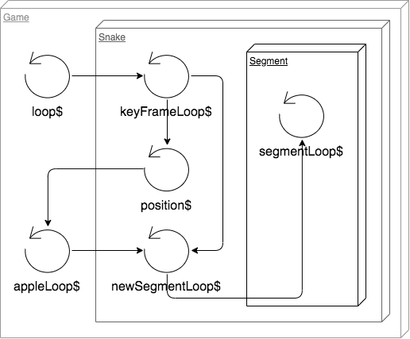
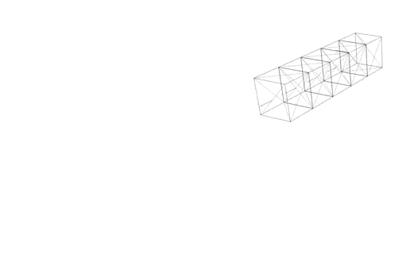
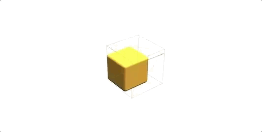

# Snake

## Game system design

Thinking about this in a natural way let's create a scene with our snake and an apple:

```html
<three-renderer>
  <three-perspective-camera… />
  <three-scene>
    ...
    <game-snake />
    <game-apple />
    ... 
  </three-scene>
</three-renderer>
```

Going on with our heuristic train of thought let's build our snake as a set of segments

```typescript
segmentPositions: Array<Vector3>
```
```html
<ng-template ngFor let-segment [ngForOf]="segmentPositions" let-i="index">
  <game-snake-segment [speed]="speed" [size]="size" [index]="i" [(loop$)]="segmentLoops[i]"… />
</ng-template>

```

### Game loop tree

We can create a unique game loop, limited to 60 fps using RxJS, from which we can branch out other streams, and can share with the other components through standard Angular inputs. It's going to look something like this in the end:



```typescript
import { timer, animationFrameScheduler } from 'rxjs';
import { scan, share } from 'rxjs/operators';
...
this.snakeSpeed = 1000; // speed in ms
this.loop$ = timer( 0, 1000 / 60, animationFrameScheduler ).pipe
(
  scan<any, { time: number, delta: number }>( previous =>
  {
    const time = performance.now();
    return { time, delta: time - previous.time };
  }, { time: performance.now(), delta: 0 } ),
  share()
)
```
```html
  <game-snake [loop$]="loop$" [speed]="snakeSpeed">
```

Now inside the snake component we can branch it to a "keyframe loop", marking each step the snake should advance to a new position depending on its speed. Basically just setting a future time marker on the current loop and advancing it forward when the current time passes it, subtracting the frame delta difference

```typescript
this.keyFrameLoop$ = this.loop$.pipe
(
  scan<{ time: number, futureTime: number, delta: number }, { futureTime: number }>( ( previous, current ) =>
  {
    current.futureTime = previous.futureTime;
    if ( current.time > previous.futureTime  ) // mark key frame
    {
      const deltaTime = current.time - current.futureTime;
      if ( deltaTime > this.speed ) // simple drop mitigation
      {
        current.delta = 16.66;
        current.futureTime = current.time + current.delta;
      }
      else
      {
        current.delta = current.time - current.futureTime;
        current.futureTime += this.speed - deltaTime;
      }
    }
    return current;
  }, { futureTime: performance.now() + this.speed } ),
);
```

Let's use this to stream the snake position

```typescript
// SnakeSegmentDirective will extend AbstractObject3D and it will have an object with a position vector
@Output() position$Change = new EventEmitter<Observable<any>>();
@ViewChildren( SnakeSegmentDirective ) segments: QueryList<SnakeSegmentDirective>;
...
// mark the key frame, filter the stream on this moment and send the segment positions
const keyFramePosition$ = this.keyFrameLoop$.pipe
(
  scan<{ futureTime: number }, { futureTime: number, select: boolean }>( ( previous, current ) =>
    ( { ...current, select: previous.futureTime !== current.futureTime } ) ),
  filter( ( { select } ) => select ),
  map( _ => this.segments.toArray().map( segment => segment.object.position.round() ) ),
);
this.position$Change.emit( keyFramePosition$ )
```

In the main game component, after view init, we can now use this to test if the snake has eaten an apple

```typescript
this.apple$ = this.snakePosition$.pipe
(
  filter( ( [ snakeHeadPosition ] ) => this.currentApplePosition.value.equals( snakeHeadPosition ) ),
  tap( snakePositions =>
  {
    const newApple = this.randomApplePosition( snakePosition );
    this.applePosition.next( newApple );
    this.score += 1;
  } ),
  map( ( [ snakeHeadPosition ] ) => snakeHeadPosition.clone() )
);
```

Sending it back to the snake so we can increase its length, i.e. add a segment at the end in the current apple position, but when last segment passes

```typescript
@Input() apple$: Observable<Vector3>;
segmentLoops: Observable<any>[];
...
const segmentLoop$ = this.keyFrameLoop$.pipe
(
  withLatestFrom( this.apple$.pipe( startWith( null as any ) ) ),
  scan<[ any, Vector3], any>( ( [ prev, appleQueue, [ lastPosition, lastQuaternion ], lastApple ], [ current, apple ] ) =>
  {
    // snake has eaten an apple, but we need to push it in a queue because we might have other segments to add before this, so we mark the current length of the snake to know when to add the cube
    if ( apple && ( !apple.equals( lastApple ) || !lastApple ) ) 
      appleQueue.push( this.segmentPositions.length - 1 );
    
    if ( lastPosition )
    {
      this.segments.last.object.position.copy( lastPosition );
      this.segments.last.object.quaternion.copy( lastQuaternion );
      [ lastPosition, lastQuaternion ] = null;
    }
    // key frame change
    if ( prev.futureTime !== current.futureTime )
    {
      // parse over queue to decrement the steps on each segment that we have to add
      appleQueue = appleQueue.reduceRight( ( queueSteps, segmentStep ) =>
      {
        // here we pop the value out if we passed it, also decrement it beforehand 
        if ( --segmentStep >= 0 ) return [ segmentStep, ...queueSteps ];
        // add new segment component
        this.segmentPositions.push( null );
        const lastCube = this.segments.last.object;
        [ lastPosition, lastQuaternion ] = [ lastCube.position.clone(), lastCube.quaternion.clone(), lastCube ];
        // trigger change detection, will create a new segment loop, see below
        this.cdr.detectChanges();
        return queueSteps;
      }, [] );
    }
    if ( apple ) lastApple = apple.clone();
    return [ current, appleQueue, [ lastPosition, lastQuaternion ], lastApple ];
  }, [ { futureTime: null }, [], null, null ] ),
  // subscribe to new segment loop
  map( _ => this.segmentLoops[ this.segmentLoops.length - 1 ] ),
  // only once
  distinctUntilChanged(),
  mergeAll(),
)
...
directions: { direction: DirectionCommand, exhaust: number[] };
cubeDiffer: IterableDiffer<any>;
this.segments.changes.subscribe( segments =>
{
  this.cubeDiffer.diff( segments ).forEachAddedItem( ( segment: IterableChangeRecord<SnakeSegmentDirective> ) =>
  {
    directions.forEach( ( { exhaust } ) => exhaust.push( exhaust[exhaust.length - 1 ] + 1 ) );
    // branch out a new loop for the added segment, see below
    this.segmentLoops.push( keyFrameDirection$.pipe( segmentDefer( segment.currentIndex ) ) );
    // increase speed
    this.speed -= 5;
    // add segment to the group, which the snake component actually is
    this.addChild( segment.item.object );
    // trigger change detection again
    this.cdr.detectChanges();
  } );
} );
...
// custom operator factory used to delay direction change for each segment
const segmentDefer = ( index: number ) => 
  ( source: Observable<any> ) => source.pipe
  (
    scan<any, any>
    ( (
      [ { futureTime: previousFutureTime } ],
      [ { futureTime, delta, time } ]
    ) =>
    {
      let nextDirection: DirectionCommand;
      // check if segment delays exhausted
      if ( previousFutureTime !== futureTime ) 
        for ( const { direction, exhaust } of directions )
          if ( !~--exhaust[ index ] ) nextDirection = direction;
      return [ { futureTime, delta, time }, nextDirection ];
    }, [ { futureTime: performance.now() } ] )
  );
```

Directions, we can implement these with a component `HostListener` and a `BehaviorSubject`, so each time we press a key it will send a new value to the subject.

```typescript
export enum DirectionCommand { UP = 1, DOWN = 2 , LEFT = 3, RIGHT = 4 }
...
private direction$ = new BehaviorSubject<DirectionCommand>( null );
@HostListener('document:keydown.w')
private directionUp() { this.direction$.next( DirectionCommand.UP ); }
@HostListener('document:keydown.a')
private directionLeft() { this.direction$.next( DirectionCommand.LEFT ); }
@HostListener('document:keydown.s')
private directionDown() { this.direction$.next( DirectionCommand.DOWN ); }
@HostListener('document:keydown.d')
private directionRight() { this.direction$.next( DirectionCommand.RIGHT ); }
```
But we also need the direction to emit its value once and then reset back, because we're going to hold it until the next key frame but we need to distinguish this moment

```typescript
const keyFrameDirection$ = combineLatest
( [ 
  this.keyFrameLoop$, 
  this.direction$.pipe( switchMap( direction => of( current, null ) ) ) // emit once and reset to null
] ).pipe
(
  scan( ( [ previous, nextDirection ], [ current, currentDirection ] ) =>
  {
    if ( previous.futureTime !== current.futureTime )
    {
      // push into the direction array all the current segments and the number of key frames needed to delay each one
      if ( nextDirection ) directions.push( { direction: nextDirection, exhaust: Array( this.segmentPositions.length ).fill( null ).map( ( _, i ) => i ) } );
      return [ current, null ]; // reset next direction
    }
    nextDirection = nextDirection || currentDirection; // capture direction change and propagate to next frames
    return [ current, nextDirection ]; // send the current time info and next direction to the accumulator
  }),
  share(),
);
```

### Let's render a snake

Based on our loops we can firstly render the snake using the segments as basic boxes.



Knowing that we have the segment loops all sent out, and delayed properly, we can take the current direction and easily rotate the segments

```typescript
export class DirectionSpecs
{
  static readonly [DirectionCommand.UP]: DirectionSpec = [  new Vector3( 1, 0, 0 ), -Math.PI / 2, new Vector3( 0, 1, -1 ), new Vector3( 0, -1, -1 ) ];
  ...
}
...
this.loop$.pipe
(
scan<any, any>
((
  [ { futureTime: previousFutureTime } ],
  [ { futureTime, delta, time }, currentDirection ]
) =>
{
  ...
  if ( !!currentDirection )
  {
    const [ axis, angle, pivot, boxPos ] = DirectionSpecs[ currentDirection ];
    this.box.quaternion.multiply( quatZero.clone().setFromAxisAngle( axis, angle ) );
    this.box.position.copy( vZero ).add( boxPos.clone().multiplyScalar( this.size / 2 ) );
  }
} );
```

What about some proper smooth animation? Since the stream has all the key frame information we can use this to create a repeating internal animation of a moving box


